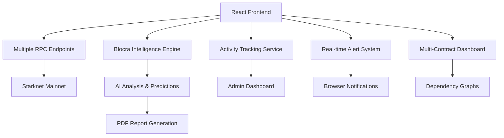

<div align="center">

# 🚀 BloDI

### Enterprise-Grade Analytics & Intelligence Platform for Starknet

[](https://opensource.org/licenses/MIT)
[](https://blodi-suite.vercel.app/)
[](https://starknet.io/)
[](https://typescriptlang.org/)
[](https://reactjs.org/)

[🌐 **Live Demo**](https://blodi-suite.vercel.app/) • [📖 **Documentation**](#-features) • [🚀 **Deploy Now**](#-quick-deploy) • [🛡️ **Admin Access**](#-admin-dashboard)

</div>

---

## 🌟 **What is BloDI?**

**BloDI (Blockchain Data Intelligence)** is a production-ready, enterprise-grade platform that revolutionizes how developers, analysts, and businesses interact with the Starknet ecosystem. Combining powerful real-time analytics with AI-powered intelligence reports and comprehensive admin monitoring, it's the ultimate toolkit for blockchain data analysis and business intelligence.

### 🎯 **Core Value Propositions**

- 📊 **Real-Time Analytics**: Live multi-contract analysis with interactive visualizations and comprehensive dashboards
- 🤖 **AI-Powered Intelligence**: Blocra Intelligence Engine with anomaly detection, predictive analytics, and pattern recognition
- 📄 **Professional Reports**: Export detailed PDF intelligence reports with risk assessment and strategic recommendations
- 🔍 **Cross-Contract Analysis**: Multi-contract ecosystem analysis with dependency graphs and interaction mapping
- ⚡ **Advanced Features**: Real-time alerts, historical data caching, state analysis, and predictive modeling
- 🛡️ **Admin Dashboard**: Comprehensive activity tracking and usage analytics for platform administrators

---

## ✨ **Key Features**

<table>
<tr>
<td width="50%">

### 🔍 **Advanced Contract Intelligence**
- **Multi-Contract Analysis**: Analyze entire project ecosystems with up to 10+ contracts
- **Real-Time Event Monitoring**: Live contract event monitoring and decoding
- **User Segmentation**: Whale, Bot, DAO, and Regular User classification with explanations
- **Dependency Graphs**: Visual contract interaction mapping and relationship analysis
- **State Analysis**: Historical contract state tracking and change detection
- **Performance Metrics**: Gas analysis, success rates, and efficiency scoring

</td>
<td width="50%">

### 🤖 **AI-Powered Intelligence**
- **Blocra Intelligence Engine**: Advanced AI analysis with 12 comprehensive report sections
- **Anomaly Detection**: Real-time detection of volume, frequency, gas, and behavior anomalies
- **Predictive Analytics**: User growth, transaction volume, and activity trend predictions
- **Pattern Recognition**: Time-based, user behavior, and transaction pattern analysis
- **Professional PDF Reports**: Business-ready intelligence documents with strategic insights
- **Risk Assessment**: Technical, operational, and market risk analysis with severity scoring

</td>
</tr>
<tr>
<td width="50%">

### 📊 **Real-Time Analytics Dashboard**
- **Live Multi-Contract Data**: Real-time RPC integration with automatic failover
- **Interactive Visualizations**: Advanced charts, graphs, gauges, and dependency networks
- **Custom Metrics**: Gas usage analysis, user retention tracking, cross-contract interactions
- **Alert System**: Custom alert conditions with browser notifications and severity levels
- **Historical Caching**: Intelligent data storage for improved performance and offline access
- **Export Capabilities**: CSV, JSON, PDF reports, and high-quality dashboard images

</td>
<td width="50%">

### 🛡️ **Admin & Enterprise Features**
- **Admin Dashboard**: Comprehensive activity tracking and usage analytics
- **User Activity Monitoring**: Track signups, logins, analyses, reports, downloads, and alerts
- **Usage Statistics**: Daily/weekly/monthly active users, conversion metrics, and trends
- **Data Export**: Complete activity logs and analytics data export capabilities
- **Real-Time Monitoring**: Live platform usage with 30-second refresh intervals
- **Security**: Password-protected admin access with activity logging

</td>
</tr>
</table>

---

## 🚀 **Quick Start**

### Prerequisites
- Node.js 18+
- pnpm (recommended) or npm

### Local Development

```bash
# Clone the repository
git clone https://github.com/Ndifreke000/BloDI.git
cd BloDI

# Install dependencies
pnpm install

# Start development server
pnpm run dev

# Build for production
pnpm run build
```

### Environment Variables

```env
# Starknet RPC Configuration
VITE_STARKNET_RPC_URL=https://starknet-mainnet.public.blastapi.io

# The app automatically uses multiple RPC endpoints with failover:
# - https://starknet-mainnet.public.blastapi.io
# - https://free-rpc.nethermind.io/mainnet-juno
# - https://starknet-mainnet.reddio.com/rpc/v0_7
# - https://rpc.starknet.lava.build
```

---

## 🎮 **How to Use BloDI**

### 1. **Multi-Contract Analysis**
```
1. 🔍 Enter Contract Addresses → Add multiple contracts using the + button
2. 📝 Add Contract Names → Provide custom names for each contract
3. 🚀 Fetch Events → Retrieve and analyze events from all contracts
4. 📊 View Dashboard → Explore cross-contract analytics and dependency graphs
5. 🔍 Monitor Alerts → Set up custom alert conditions for real-time monitoring
```

### 2. **Generate Intelligence Reports**
```
1. 📊 Complete Multi-Contract Analysis → Ensure you have fetched contract data
2. 🤖 Generate AI Report → Click "Generate PDF Report" 
3. ⏳ Wait for Analysis → Blocra Intelligence Engine processes all contract data
4. 📄 Download PDF → Get comprehensive 12-section intelligence report
```

### 3. **Advanced Analytics & Monitoring**
```
1. 📈 View Predictions → AI-powered forecasts for user growth and activity
2. ⚠️ Monitor Anomalies → Real-time detection of unusual patterns
3. 🔔 Set Alerts → Custom conditions for volume, frequency, and behavior
4. 📊 Dependency Analysis → Visualize contract interactions and relationships
```

### 4. **Admin Dashboard Access**
```
🛡️ Admin URL: /admin
📧 Email: Ndiiekanem41@gmail.com
🔑 Password: Mkpanam200

Features:
- Real-time user activity monitoring
- Usage statistics and trends
- Contract analysis tracking
- Report generation metrics
- Download and export analytics
- Data export capabilities
```

---

## 🏗️ **Architecture Overview**



### 🛠️ **Tech Stack**

| Layer | Technology | Purpose |
|-------|------------|----------|
| **Frontend** | React + Vite + TypeScript | Modern, fast UI development |
| **Styling** | Tailwind CSS + shadcn/ui | Beautiful, responsive design |
| **Charts** | Recharts + Canvas API | Interactive visualizations & dependency graphs |
| **Blockchain** | Starknet RPC + starknet.js | Real-time multi-contract data |
| **AI Engine** | Blocra Intelligence Engine | Advanced analytics & predictions |
| **Data Storage** | IndexedDB | Client-side caching & activity tracking |
| **Reports** | jsPDF | Professional PDF generation |
| **Alerts** | Web Notifications API | Real-time browser notifications |
| **Admin** | Activity Tracking Service | Comprehensive usage monitoring |
| **Deployment** | Vercel | Global CDN deployment |

---

## 📊 **Intelligence Report Sections**

BloDI generates comprehensive 12-section reports:

- **📋 Contract Information**: Address, type, deployment details, current status
- **📈 Executive Summary**: Key performance indicators and strategic assessment  
- **⚡ Performance Analysis**: Gas efficiency, reliability metrics, user retention
- **💼 Business Insights**: User behavior patterns with segment explanations
- **⚠️ Risk Assessment**: Technical, operational, and market risk factors
- **🔧 Technical Analysis**: Event architecture, cross-contract interactions
- **🎯 Market Position**: Competitive analysis, growth trajectory
- **📋 Strategic Recommendations**: Immediate actions and long-term strategy
- **🔍 Function & Usage Analysis**: Top functions, call frequency, whale dependency
- **⛽ Gas Analysis**: Optimization insights and efficiency recommendations
- **🏛️ Ownership & Upgradeability**: Contract governance and centralization risks
- **💰 Balance & Value Flow**: Current holdings and transaction volume analysis

---

## 🎯 **User Segments Explained**

BloDI automatically classifies contract users with detailed explanations:

- **🐋 Whale**: Large holder/investor making high-value transactions with substantial token holdings
- **🤖 Bot**: Automated trading program performing programmatic transactions for arbitrage or market making  
- **🏛️ DAO**: Decentralized organization treasury or governance contract managing protocol operations
- **👤 Regular User**: Individual retail user making standard transactions like transfers, swaps, or typical interactions

*Each segment includes interaction counts and explanations to help non-technical users understand the ecosystem.*

---

## 🛡️ **Admin Dashboard**

### Access Information
- **URL**: `/admin`
- **Email**: `Ndiiekanem41@gmail.com`
- **Password**: `Mkpanam200`
- **Features**: Real-time activity monitoring, usage analytics, data export

### Tracked Activities
- **User Management**: Signups, logins, user engagement
- **Contract Analysis**: Multi-contract analyses, dependency graphs
- **Report Generation**: AI reports created and downloaded
- **Dashboard Usage**: Dashboard creations and interactions
- **File Exports**: Image exports, CSV/JSON downloads
- **Alert System**: Alert rule creations and notifications

### Analytics Provided
- **Usage Statistics**: Daily/weekly/monthly active users
- **Activity Trends**: 7/30/90-day activity charts
- **Top Contracts**: Most analyzed contracts with usage counts
- **Real-time Monitoring**: Live activity feed with filtering
- **Data Export**: Complete activity logs in JSON format

---

## 🌍 **Production Deployment**

### One-Click Deployment

[](https://vercel.com/new/clone?repository-url=https://github.com/Ndifreke000/BloDI)

### Manual Deployment

```bash
# Build the application
pnpm run build

# Deploy to your preferred platform
# The app is optimized for Vercel, Netlify, or any static hosting
```

---

## 📈 **Performance Metrics**

<div align="center">

| Metric | Value | Status |
|--------|-------|--------|
| **Build Time** | <30s | 🟢 Fast |
| **Bundle Size** | Optimized | 🟢 Efficient |
| **RPC Failover** | 4 Endpoints | 🟢 Reliable |
| **Report Generation** | <5s | 🟢 Quick |
| **Real-time Updates** | 10s intervals | 🟢 Live |
| **Admin Monitoring** | 30s refresh | 🟢 Real-time |
| **Mobile Support** | Responsive | 🟢 Compatible |

</div>

---

## 🔧 **Development**

### Project Structure
```
src/
├── components/          # Reusable UI components
│   ├── AlertPanel.tsx          # Real-time alert management
│   ├── DependencyGraph.tsx     # Contract interaction visualization
│   └── AdminRoute.tsx          # Admin authentication
├── pages/              # Main application pages
│   ├── ContractEventsEDA.tsx   # Multi-contract analysis
│   └── AdminDashboard.tsx      # Admin monitoring panel
├── services/           # Business logic and API services
│   ├── AIAnalysisService.ts    # Blocra Intelligence Engine
│   ├── AdvancedAIService.ts    # Anomaly detection & predictions
│   ├── ActivityTrackingService.ts # Admin activity monitoring
│   ├── AlertService.ts         # Real-time alert system
│   ├── DatabaseService.ts      # IndexedDB data management
│   ├── DependencyGraphService.ts # Contract relationship analysis
│   ├── PDFReportService.ts     # Professional report generation
│   ├── RealtimeService.ts      # Live update management
│   └── StateAnalysisService.ts # Historical state tracking
├── lib/                # Utility functions
└── styles/             # Global styles and themes
```

### Key Services

- **ActivityTrackingService**: Comprehensive user activity monitoring for admin dashboard
- **AdvancedAIService**: Anomaly detection, predictive analytics, and pattern recognition
- **AlertService**: Custom alert conditions with real-time browser notifications
- **DatabaseService**: IndexedDB-based caching for performance and offline access
- **DependencyGraphService**: Cross-contract interaction analysis and visualization

---

## 🤝 **Contributing**

We welcome contributions! Here's how to get started:

1. **Fork** the repository
2. **Create** a feature branch (`git checkout -b feature/amazing-feature`)
3. **Commit** your changes (`git commit -m 'Add amazing feature'`)
4. **Push** to the branch (`git push origin feature/amazing-feature`)
5. **Open** a Pull Request

---

## 📄 **License**

```
MIT License

Copyright (c) 2025 BloDI - Blockchain Data Intelligence

Permission is hereby granted, free of charge, to any person obtaining a copy
of this software and associated documentation files (the "Software"), to deal
in the Software without restriction, including without limitation the rights
to use, copy, modify, merge, publish, distribute, sublicense, and/or sell
copies of the Software, and to permit persons to whom the Software is
furnished to do so, subject to the following conditions:

The above copyright notice and this permission notice shall be included in all
copies or substantial portions of the Software.

THE SOFTWARE IS PROVIDED "AS IS", WITHOUT WARRANTY OF ANY KIND, EXPRESS OR
IMPLIED, INCLUDING BUT NOT LIMITED TO THE WARRANTIES OF MERCHANTABILITY,
FITNESS FOR A PARTICULAR PURPOSE AND NONINFRINGEMENT. IN NO EVENT SHALL THE
AUTHORS OR COPYRIGHT HOLDERS BE LIABLE FOR ANY CLAIM, DAMAGES OR OTHER
LIABILITY, WHETHER IN AN ACTION OF CONTRACT, TORT OR OTHERWISE, ARISING FROM,
OUT OF OR IN CONNECTION WITH THE SOFTWARE OR THE USE OR OTHER DEALINGS IN THE
SOFTWARE.
```

---

<div align="center">

**Built with ❤️ for the Starknet Community**

[🌐 Website](https://blodi-suite.vercel.app/) • [📖 Docs](#-features) • [🛡️ Admin](/admin) • [🐦 Twitter](https://twitter.com/blodi_suite) • [💬 Discord](https://discord.gg/blodi)

⭐ **Star us on GitHub** if you find BloDI useful for your blockchain analytics!

</div>